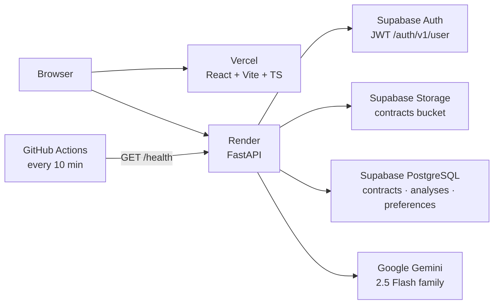
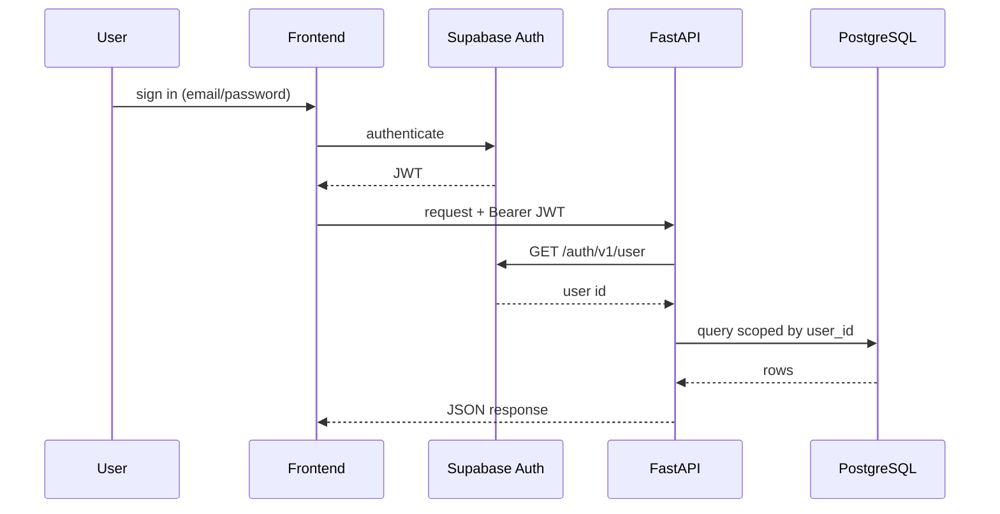
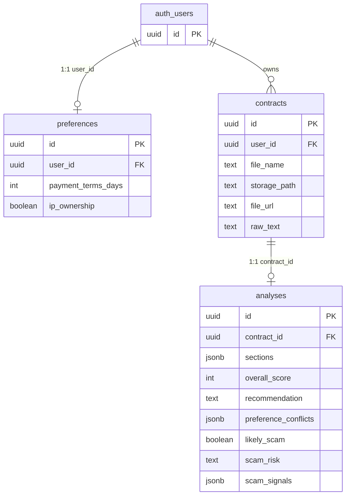
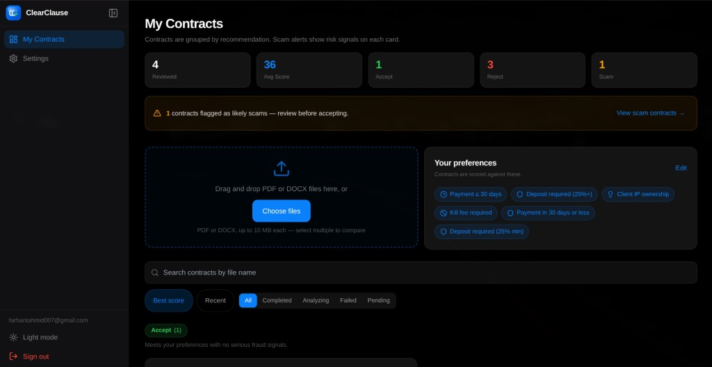
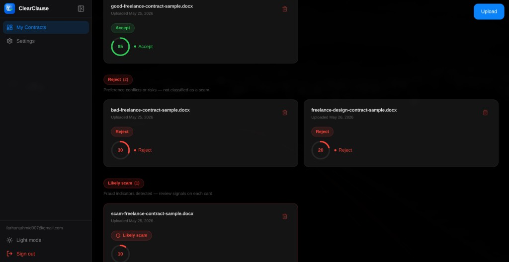
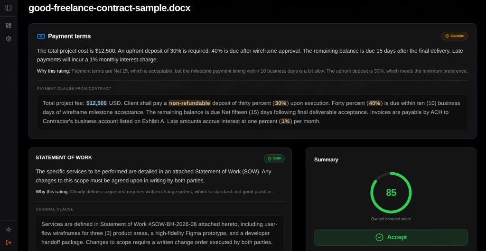
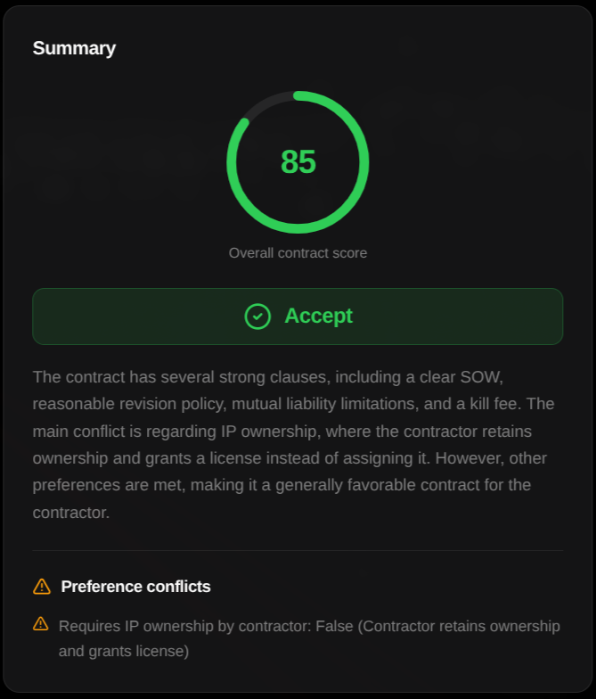
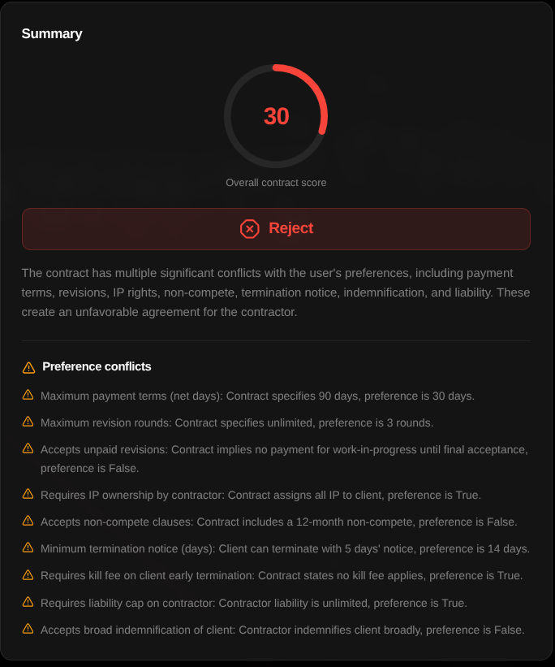
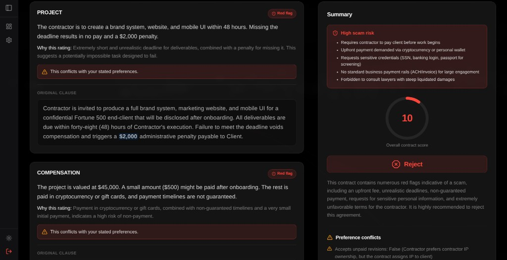

# ClearClause

**AI-powered freelance contract analysis** — upload a PDF or DOCX, get per-section risk scoring, preference-aware recommendations, and a dedicated fraud-detection layer. Built as a full-stack portfolio system, not a thin wrapper around a language model.

[](https://clearclause.vercel.app)
[](#tech-stack)
[](LICENSE)

---

## Overview

Freelancers often sign client agreements without spotting harsh payment terms, one-sided IP grabs, or outright scam patterns buried in legalese. ClearClause turns opaque contract PDFs/DOCX files into **structured, actionable analysis**: section-by-section plain-English summaries, preference conflicts, accept/reject guidance, and a **three-tier scam risk model** backed by deterministic pattern matching—not a single LLM score.

**Built for:** independent contractors, designers, and developers who want a fast second opinion before signing—and for recruiters evaluating full-stack + applied-AI engineering (parsing pipelines, auth, RLS, structured LLM output, production deploy).

---

## Live demo

| Service | URL |
|---------|-----|
| **Frontend** | [https://clearclause.vercel.app](https://clearclause.vercel.app) |
| **API** | [https://clearclause-api.onrender.com](https://clearclause-api.onrender.com) |
| **Health** | `GET /health` → `{"status":"ok"}` |

---

## Try with sample contracts

No contract handy? **Sign in** at the [live demo](https://clearclause.vercel.app), open **Dashboard**, and upload a `.docx` from the repo [`samples/`](samples/) folder (clone locally or download from GitHub).

| Sample | File | Expected outcome |
|--------|------|------------------|
| Good | `good-freelance-contract-sample.docx` | High score, **accept** |
| Bad | `bad-freelance-contract-sample.docx` | **Reject**, preference conflicts |
| Long | `long-freelance-contract-sample.docx` | Long-document parsing test |
| Scam | `scam-freelance-contract-sample.docx` | **`likely_scam`**, high **scam_risk** |

Clause-level detail: [`samples/README.md`](samples/README.md).

---

## Features

### Auth

- Email/password sign-up and sign-in via **Supabase Auth**
- JWT sessions; the FastAPI layer validates every protected request against Supabase’s `GET /auth/v1/user` (no shared JWT secret on the API)

### Upload

- **PDF** (`pdfplumber`) and **DOCX** (`python-docx`) parsed server-side
- Files stored in **Supabase Storage**; metadata in Postgres
- **10 MB** upload limit, magic-byte validation, per-user rate limits

### Analysis

- **Google Gemini** (default `gemini-2.5-flash-lite`, configurable `GEMINI_MODEL` with automatic model fallbacks)
- **Per-section** JSONB scoring (title, plain English, original quote, risk level, preference conflict flag)
- **`preference_conflicts`** extracted as a separate structured field
- **`overall_score`** (0–100) and **`recommendation`** (`accept` \| `reject`) with Pydantic validation + normalization fallbacks for malformed model output

### Dashboard

- Preference-weighted recommendations surfaced in the UI
- Stats strip (reviewed count, average score, accept/reject, scam attention)
- Filtering by recommendation and scam bucket; mobile-friendly layout

---

## System architecture



---

## Tech stack

| Layer | Technology | Why |
|-------|------------|-----|
| **Frontend** | React + TypeScript + Vite | Type-safe SPA, fast dev/build, deployed on Vercel |
| **UI** | Tailwind CSS, shadcn/ui, Lucide | Consistent components, accessible patterns |
| **API** | FastAPI (Python 3.11+) | Async REST, modular routers, OpenAPI-friendly |
| **Database** | Supabase PostgreSQL | Managed Postgres, migrations, connection pooling |
| **Auth** | Supabase Auth | JWT issuance; API validates tokens remotely |
| **Storage** | Supabase Storage | Durable file blobs with service-role upload/delete |
| **AI** | Gemini 2.5 Flash (lite default) | Fast structured JSON generation; fallback model chain |
| **Parsing** | pdfplumber, python-docx | Server-side text extraction before LLM prompts |
| **Hosting** | Vercel + Render | Zero-config frontend; Python web service on free tier |
| **Ops** | GitHub Actions keep-alive | Reduces Render cold starts via scheduled `/health` pings |

---

## Engineering deep dive

### a) Modular FastAPI architecture

- **Domain routers:** `/contracts`, `/analysis`, `/preferences` — thin handlers, logic in `services/`
- **Security headers middleware:** `X-Content-Type-Options`, `X-Frame-Options`, `Referrer-Policy`, `Permissions-Policy`, **HSTS** in production
- **CORS:** Starlette `CORSMiddleware` plus **`cors_helpers.with_loopback_aliases`** so `localhost` ↔ `127.0.0.1` on the same port both work during local dev
- **`db_errors.py`:** maps SQLAlchemy exceptions to typed HTTP responses
- **Global 500 handler:** every unhandled exception returns JSON (critical—raw tracebacks bypass CORS headers on some proxies)

### b) JWT authentication

Protected routes depend on `get_current_user_id` in `backend/deps.py`:

1. Read `Authorization: Bearer <jwt>`
2. Call Supabase **`GET /auth/v1/user`** with the user’s JWT + anon `apikey`
3. Extract `user_id` from the response; scope all DB queries by that UUID

No API-side JWT signing secret—the identity provider remains the source of truth. **`GET /health/config`** exposes non-sensitive diagnostics (which env vars are set, Supabase reachability) without leaking secrets.



### c) Contract parsing pipeline

| Format | Library | Notes |
|--------|---------|--------|
| PDF | `pdfplumber` | Page-by-page text extraction |
| DOCX | `python-docx` | Paragraph text joined |

Flow: **upload → validate type/size → extract text → (optional) persist `raw_text` → Storage + DB row**.

- **`CONTRACT_TEXT_PERSISTENCE_ENABLED`** — gate whether parsed text is stored
- **`CONTRACT_TEXT_RETENTION_DAYS`** — background job nulls `raw_text` after retention window

### d) AI analysis & structured output

1. Cleaned contract text + **13 preference fields** are embedded in the Gemini prompt (`backend/services/gemini.py`).
2. Model returns JSON only (sections, scores, conflicts); fences stripped via `_extract_json_object`.
3. **`_normalize_analysis_payload`** coerces bad enums, clamps scores, caps section count—then **Pydantic `AnalysisResult`** validates.
4. On **502** parse/validate failure, the service retries with a compact prompt for long contracts (>18k chars).
5. **Scam fields from the LLM are intentionally zeroed** before merge—fraud classification is owned by the rule engine (below).

### e) Scam detection — 3-tier risk system

This is **not** a binary “GPT said scam” flag.

| Field | Type | Role |
|-------|------|------|
| `scam_signals` | JSONB array | Human-readable labels (e.g. crypto upfront fee, credential harvest) |
| `scam_risk` | `low` \| `medium` \| `high` | Tier from weighted regex rules + legitimacy dampeners |
| `likely_scam` | boolean | Hard flag when score ≥ thresholds or multiple critical pattern hits |

**`backend/services/scam_detection.py`** runs ~10 weighted rules (crypto upfront, contractor-pays-client, credential requests, etc.). Scores aggregate rule weights; LLC/address patterns **reduce** false positives on harsh but legitimate deals. **`merge_scam_into_analysis`** makes the engine the source of truth, merges filtered AI signal text, forces **`reject`** and caps **`overall_score`** when `likely_scam` is true.

```text
contract text → regex rules → weighted score → risk tier + signals
                              ↓
                    merge with Gemini clause analysis → persisted JSONB
```

### f) Preference-weighted scoring

The `preferences` table holds **13 structured fields** used in every analysis prompt:

| Numeric thresholds | Boolean flags |
|--------------------|---------------|
| `payment_terms_days`, `min_deposit_percent`, `max_revision_rounds`, `termination_notice_days` | `ip_ownership`, `kill_fee_required`, `requires_deposit`, `non_compete`, `unpaid_revisions`, `liability_cap_required`, `written_scope_required`, `accepts_broad_indemnification` |

Gemini scores each section with `conflicts_with_preference` and emits a top-level **`preference_conflicts`** list. Recommendations are personalized: the same harsh Net-90 clause may be acceptable for one user’s payment window and a hard reject for another.

### g) Database schema & row level security



**RLS policies** (from [`supabase/schema.sql`](supabase/schema.sql)):

| Table | Policy | Rule |
|-------|--------|------|
| `preferences` | Users can manage own preferences | `auth.uid() = user_id` |
| `contracts` | Users can manage own contracts | `auth.uid() = user_id` |
| `analyses` | Users can view own analyses | `contract_id IN (SELECT id FROM contracts WHERE user_id = auth.uid())` |

**Why analyses use a subquery:** `analyses` has no `user_id` column—ownership is **derived through `contracts`**, so RLS enforces indirect tenancy without denormalizing user IDs.

Contract CRUD in production goes through the **FastAPI + `DATABASE_URL`** path (service role connection); RLS still protects direct Supabase client access with the anon key.

### h) File storage & lifecycle

1. **Upload** → Supabase Storage (`contracts` bucket) → `storage_path` + `file_url` on `contracts` row  
2. **Delete** → remove Storage object + DB row → **`ON DELETE CASCADE`** removes the 1:1 `analyses` row  
3. **Unique `contract_id`** on `analyses` prevents duplicate analysis records per contract  

---

## API reference

<details>
<summary><strong>REST endpoints (FastAPI)</strong></summary>

All protected routes require `Authorization: Bearer <supabase_jwt>`.

| Method | Path | Description |
|--------|------|-------------|
| `GET` | `/health` | Keep-alive ping → `{"status":"ok"}` |
| `GET` | `/health/config` | Non-sensitive env diagnostics + Supabase reachability |
| `POST` | `/contracts/upload` | Parse PDF/DOCX, store file + contract row |
| `GET` | `/contracts` | List current user's contracts |
| `DELETE` | `/contracts/{id}` | Delete contract, Storage object, cascaded analysis |
| `POST` | `/analysis/{contract_id}` | Run Gemini analysis (idempotent upsert on row) |
| `GET` | `/analysis/{contract_id}` | Fetch analysis for a contract |
| `GET` | `/preferences` | Get user preferences (defaults if none) |
| `POST` | `/preferences` | Create or update preferences (upsert) |

</details>

---

## Local development

### Prerequisites

- Node.js 20+
- Python 3.11+
- [Supabase](https://supabase.com/) project (Auth + Storage + Postgres)
- [Google AI Studio](https://aistudio.google.com/) API key

### Supabase setup

1. Run [`supabase/schema.sql`](supabase/schema.sql) in the SQL editor.
2. Create a **public** Storage bucket named `contracts`.
3. Use the **connection pooler** URI for `DATABASE_URL` if local IPv6 to `db.*.supabase.co` fails.

### Environment variables

#### Frontend (`frontend/.env`)

| Variable | Description | Where to get it |
|----------|-------------|-----------------|
| `VITE_SUPABASE_URL` | Project URL | Supabase → Project Settings → API |
| `VITE_SUPABASE_ANON_KEY` | Publishable / anon key | Same (never service role) |
| `VITE_API_URL` | API base, no trailing slash | Local: `http://localhost:8000` |

#### Backend (`backend/.env`)

| Variable | Description | Where to get it |
|----------|-------------|-----------------|
| `GEMINI_API_KEY` | Generative AI key | Google AI Studio |
| `GEMINI_MODEL` | Model id (default `gemini-2.5-flash-lite`) | [Gemini models docs](https://ai.google.dev/gemini-api/docs/models) |
| `SUPABASE_URL` | Project URL | Supabase → API settings |
| `SUPABASE_ANON_KEY` | Anon/publishable key | JWT validation via Auth API |
| `SUPABASE_SERVICE_ROLE_KEY` | Service role key | Storage upload/delete only |
| `DATABASE_URL` | Postgres URI | Supabase → Database → Connection string (pooler) |
| `CORS_ORIGINS` | Allowed browser origins | Your Vercel URL + local Vite origin |
| `APP_ENV` | `development` \| `production` | Set `production` on Render |
| `CONTRACT_TEXT_PERSISTENCE_ENABLED` | Store parsed text in DB | `true` / `false` |
| `CONTRACT_TEXT_RETENTION_DAYS` | Auto-null `raw_text` after N days | e.g. `30` |

Copy from `frontend/.env.example` and `backend/.env.example`. **Never commit real keys.**

### Run locally

**Backend**

```bash
cd backend
python -m venv .venv
source .venv/bin/activate   # Windows: .venv\Scripts\activate
pip install -r requirements.txt
cp .env.example .env
uvicorn main:app --reload --host 0.0.0.0 --port 8000
```

**Frontend**

```bash
cd frontend
npm install
cp .env.example .env
npm run dev
```

**Quick start (repo root)**

```bash
bash scripts/dev-up.sh
```

Opens Vite (default `http://localhost:5173`), restarts API, runs smoke checks. Upload a file from `samples/`.

### Auth tips

- **Confirm email** in Supabase → Email provider: ON for production, OFF for instant local demos.
- Add `http://127.0.0.1:5173/**` and your production URL to **Redirect URLs**.

### Deployment (summary)

| Target | Root / command |
|--------|----------------|
| **Vercel** | `frontend/` — `npm run build`, output `dist` |
| **Render** | `backend/` — `uvicorn main:app --host 0.0.0.0 --port $PORT` |
| **Keep-alive** | `.github/workflows/render-keepalive.yml` pings `/health` every 10 minutes |

Set production `CORS_ORIGINS` to explicit Vercel origin(s)—not `*`.

---

## What I built (skills summary)

- Production **FastAPI** backend: modular routers, security headers, CORS loopback aliasing, SQLAlchemy error mapping, JSON 500 fallback
- **Document parsing pipeline** (PDF + DOCX) with validation, retention, and Storage integration
- **Structured LLM output**: per-section JSONB schema, Pydantic validation, normalization retries for malformed Gemini responses
- **3-tier scam detection**: weighted regex engine → risk tier → `likely_scam`, merged with clause analysis (engine is source of truth)
- **Preference-weighted scoring** across 13 user-defined contract criteria
- **PostgreSQL schema** with cascading deletes, 1:1 contract–analysis constraint, RLS with subquery-based analysis ownership
- **Supabase Auth** JWT validation via remote `/auth/v1/user` (no shared secret on API)
- **Full-stack deploy**: Vercel frontend + Render API + GitHub Actions keep-alive

---

## Screenshots



*Dashboard with stats, upload, preferences, and contract filters.*



*Contracts grouped by accept, reject, and scam risk.*



*Section-by-section analysis with payment terms and overall accept (score 85).*



*Summary card recommending accept, including preference conflicts.*



*Summary card for a weak contract with reject guidance (score 30).*



*High-risk scam contract flagged for reject (score 10).*

---

## Repository layout

| Path | Description |
|------|-------------|
| [`frontend/`](frontend/) | React + TypeScript + Vite SPA |
| [`backend/`](backend/) | FastAPI, Gemini, parsers, scam engine |
| [`supabase/schema.sql`](supabase/schema.sql) | Tables, RLS, indexes |
| [`samples/`](samples/) | Demo contracts (good, bad, long, scam) |
| [`render.yaml`](render.yaml) | Render blueprint for the API |

---

## License

[MIT](LICENSE) — free to use and modify. **AI output is informational only and is not legal advice.**
