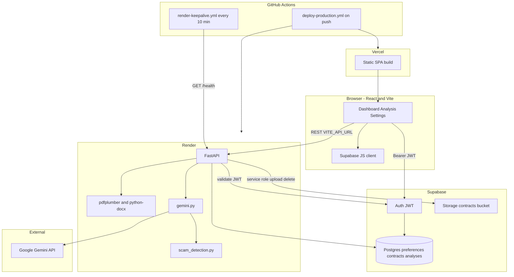
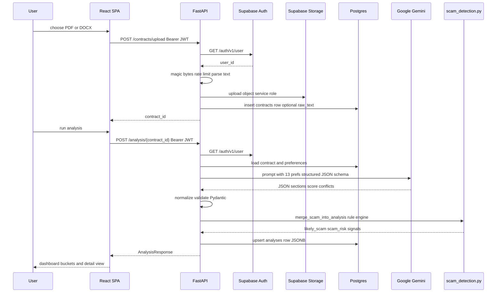
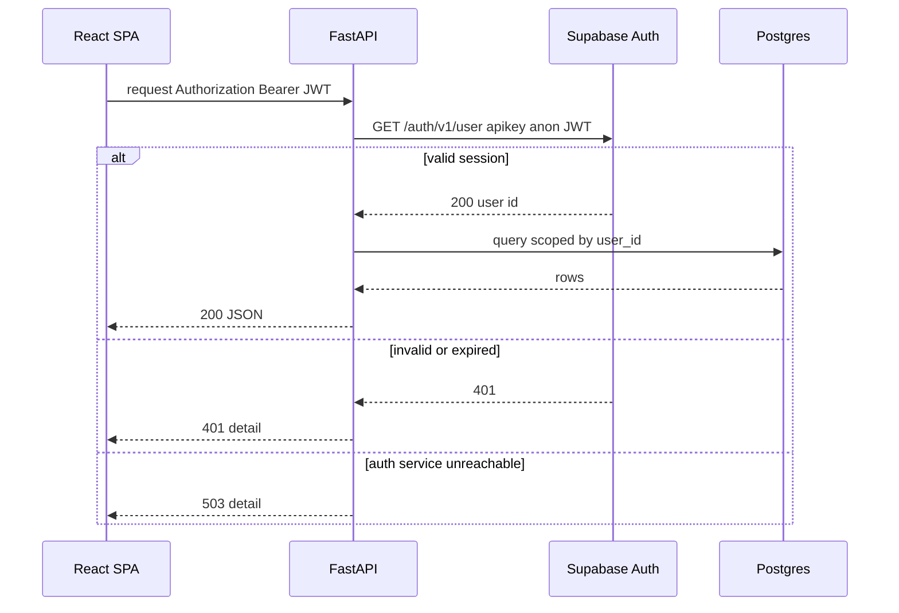

# ClearClause

**Live demo:** [https://clearclause.vercel.app](https://clearclause.vercel.app) · **API:** [https://clearclause-api.onrender.com](https://clearclause-api.onrender.com)

ClearClause is a full-stack freelance contract analyzer. Upload a PDF or DOCX, get per-section plain-English summaries, preference-weighted accept/reject guidance, and a three-tier scam risk model backed by deterministic pattern matching—not a single LLM score.

The backend handles document parsing, structured AI output with validation fallbacks, JWT auth without shared secrets, Postgres + RLS, Supabase Storage lifecycle, and split hosting (Vercel + Render) with CI keep-alive.

[](https://clearclause.vercel.app)
[](#tech-stack)
[](LICENSE)

---

## Screenshots

### Dashboard — stats, upload, preferences, filters


### Contract list — accept, reject, and scam buckets


### Analysis — section breakdown and score


### Summary — accept with preference conflicts


### Summary — reject (harsh contract)


### Scam detection — high-risk reject


---

## What this project is

| | |
|---|---|
| **Problem** | Freelancers sign client agreements without spotting harsh payment terms, one-sided IP clauses, or predatory scam patterns buried in legalese. A single “AI score” does not explain *which* clauses conflict with *their* business rules. |
| **Solution** | ClearClause extracts contract text server-side, runs structured Gemini analysis per section against 13 user-defined preferences, and merges a separate weighted regex scam engine. The dashboard groups contracts by accept/reject/scam and surfaces concrete signals—not generic legal advice. |
| **Scope** | End-to-end: React SPA (Vercel), FastAPI API (Render), Supabase Auth + Postgres + Storage, Google Gemini, GitHub Actions deploy + keep-alive, local smoke tests. |

---

## Try with sample contracts

No contract handy? **Sign in** at the [live demo](https://clearclause.vercel.app), open **Dashboard**, and upload a `.docx` from [`samples/`](samples/) (clone locally or download from GitHub).

| Sample | File | Expected outcome |
|--------|------|------------------|
| Good | `good-freelance-contract-sample.docx` | High score, **accept** |
| Bad | `bad-freelance-contract-sample.docx` | **Reject**, preference conflicts |
| Long | `long-freelance-contract-sample.docx` | Long-document parsing test |
| Scam | `scam-freelance-contract-sample.docx` | **`likely_scam`**, high **scam_risk** |

Clause-level detail: [`samples/README.md`](samples/README.md).

---

## Features

- **Auth** — email/password via Supabase Auth; FastAPI validates every protected request with `GET /auth/v1/user` (no API-side JWT signing secret)
- **Upload** — PDF (`pdfplumber`) and DOCX (`python-docx`); 10 MB limit, magic-byte checks, Supabase Storage
- **Analysis** — Gemini 2.5 Flash family (configurable `GEMINI_MODEL`, automatic model fallbacks); per-section JSONB in Postgres
- **Preferences** — 13 structured fields (payment terms, deposit, IP, non-compete, liability, etc.) injected into every analysis prompt
- **Scam detection** — `likely_scam`, `scam_risk` (`low` \| `medium` \| `high`), `scam_signals` JSONB; rule engine is source of truth over LLM scam fields
- **Dashboard** — stats strip, accept/reject/scam buckets, search and status filters, mobile-friendly layout

---

## System architecture

ClearClause is a React SPA on **Vercel**. The browser talks to **Supabase Auth** for sign-in and to **Render (FastAPI)** for contracts, analysis, and preferences. The API calls **Google Gemini** for clause analysis, **Supabase Storage** for files, and **Postgres** (via `DATABASE_URL`) for metadata and analysis rows. **GitHub Actions** pings `/health` on a schedule to reduce Render free-tier cold starts.



### Component responsibilities

| Component | Role in ClearClause |
|-----------|---------------------|
| **Vercel** | Hosts the React SPA; `vercel.json` SPA rewrites; production env embeds `VITE_*` at build time |
| **Render** | Hosts FastAPI; Gemini calls run **only** on the server; CORS allowlist for Vercel origins |
| **Supabase Auth** | Issues JWTs; API re-validates each request via `/auth/v1/user` with the caller’s token |
| **Supabase Postgres** | `preferences`, `contracts`, `analyses`; RLS for direct client access; API uses pooler `DATABASE_URL` |
| **Supabase Storage** | `contracts` bucket; service role for upload/delete; public URL stored on contract row |
| **Google Gemini** | Structured JSON clause analysis; model fallback chain on 404/quota/timeout |
| **GitHub Actions** | Production deploy (Vercel + optional Render hook); scheduled `/health` keep-alive |

---

## Request flows

### Contract upload and analysis



### Auth validation on every protected request



---

## Engineering highlights

### 1. Contract analysis pipeline (`backend/services/gemini.py`, `scam_detection.py`)

| Gemini gives | ClearClause adds |
|--------------|------------------|
| Free-form text generation | **JSON-only prompt** with explicit schema: sections, `overall_score`, `recommendation`, `preference_conflicts` |
| Single model call | **Length-aware prompts**: contracts over 18k chars use a compact section set; up to 48k chars excerpted; **retry** with compact prompt on 502 parse/validate failure |
| Model availability | **Fallback chain** (`GEMINI_MODEL` → `gemini-2.5-flash-lite`, `gemini-2.5-flash`, `gemini-2.0-flash-lite`, …) on 404, quota, timeout |
| Unstructured output | **`_normalize_analysis_payload`** coerces risk enums, clamps scores, caps sections; **Pydantic `AnalysisResult`** validation; fence-stripped JSON extraction |
| Scam classification in LLM output | **LLM scam fields zeroed** before merge; **`scam_detection.py`** weighted regex rules + legitimacy dampeners → `likely_scam`, `scam_risk`, `scam_signals`; forces reject and score cap on confirmed fraud |
| Generic scoring | **13 preference fields** embedded in prompt; per-section `conflicts_with_preference`; separate `preference_conflicts` JSONB column |

### 2. Auth and security model (`backend/deps.py`, `main.py`, `supabase/schema.sql`)

| Supabase gives | ClearClause adds |
|----------------|------------------|
| JWT issuance and user table | **Remote validation** on every protected route: `GET /auth/v1/user` with caller’s bearer token + anon `apikey`—no shared JWT secret on FastAPI |
| RLS policies | **Subquery ownership** on `analyses` (`contract_id IN (SELECT … WHERE user_id = auth.uid())`) because analyses have no `user_id` column |
| Service role key | **Strict separation**: service role **only** for Storage upload/delete; anon key for auth validation; Postgres via `DATABASE_URL` for app CRUD |
| Default CORS | **Explicit `CORS_ORIGINS`** in production; **`cors_helpers.with_loopback_aliases`** mirrors `localhost` ↔ `127.0.0.1` for local Vite |
| N/A | **Security headers middleware** (nosniff, DENY frame, HSTS in prod, referrer/permissions policy); **global JSON 500 handler** so errors pass through CORS |

### 3. File handling (`backend/services/parser.py`, `storage.py`, `routers/contracts.py`)

| Supabase Storage gives | ClearClause adds |
|------------------------|------------------|
| Blob store | **PDF** (`pdfplumber` per page) and **DOCX** (`python-docx` paragraphs) extraction before any LLM call |
| Upload API | **10 MB cap**, MIME + **magic-byte** validation (`%PDF`, ZIP signature for DOCX) |
| Public URLs | **Lifecycle**: upload → `storage_path` + `file_url` on `contracts`; delete removes Storage object **and** DB row; **`ON DELETE CASCADE`** on `analyses` |
| N/A | **`CONTRACT_TEXT_PERSISTENCE_ENABLED`** and **`CONTRACT_TEXT_RETENTION_DAYS`**: optional `raw_text` in DB, auto-nulled after retention window on list/upload |

### 4. Rate limiting design (`backend/security.py`)

| Platform gives | ClearClause adds |
|----------------|------------------|
| N/A | **`FixedWindowRateLimiter`**: per-user keys `upload:{user_id}` and `analysis:{user_id}` |
| N/A | **Separate limits** via env: `RATE_LIMIT_UPLOADS_PER_MINUTE` (default 20), `RATE_LIMIT_ANALYSIS_PER_MINUTE` (default 30); 429 with clear message |
| N/A | **In-process** sliding window (60s); suitable for single-instance Render; tests in `backend/tests/test_security.py` |

### 5. CI, keep-alive, and verification (`scripts/`, `.github/workflows/`)

| GitHub / Render give | ClearClause adds |
|----------------------|------------------|
| Hosted runners | **`deploy-production.yml`**: Render deploy hook (optional) + Vercel production deploy + **alias `clearclause.vercel.app`**; fails on invalid Vercel token (`pipefail`) |
| Free-tier sleep | **`render-keepalive.yml`**: `GET /health` every 10 minutes (reduces cold starts; does not eliminate them) |
| N/A | **`scripts/smoke-local.py`**: config, parser, storage, DB, Gemini, health—run via **`scripts/dev-up.sh`** |
| N/A | **`scripts/verify-*.sh`**, **`scripts/deploy-production.sh`** for staged production checks |

---

## Tech stack

| Layer | Tools |
|-------|--------|
| Frontend | React 18, TypeScript, Vite, TanStack Query, Tailwind, shadcn/ui |
| Backend | FastAPI, SQLAlchemy, pdfplumber, python-docx, google-generativeai |
| Database & auth | Supabase (Postgres, RLS, email/password auth, Storage) |
| AI | Google Gemini 2.5 Flash family (`GEMINI_MODEL`, fallbacks) |
| Hosting | Vercel (SPA) · Render (API) · [clearclause.vercel.app](https://clearclause.vercel.app) |

---

## Database (Supabase)

| Table | Purpose |
|-------|---------|
| `preferences` | 1:1 with user — 13 contract criteria (payment days, deposit %, IP, non-compete, liability, etc.) |
| `contracts` | `file_name`, `storage_path`, `file_url`, optional `raw_text`, `user_id` |
| `analyses` | 1:1 with contract — `sections` JSONB, `overall_score`, `recommendation`, `preference_conflicts`, scam fields |

RLS: users manage own `preferences` and `contracts`; `analyses` readable when `contract_id` belongs to the user (subquery). App CRUD goes through FastAPI + `DATABASE_URL`; RLS protects direct Supabase client access with the anon key.

Schema: [`supabase/schema.sql`](supabase/schema.sql). Older projects: [`supabase/migrations/20260524_scam_and_preferences.sql`](supabase/migrations/20260524_scam_and_preferences.sql).

---

## API reference

<details>
<summary><strong>REST endpoints (FastAPI)</strong></summary>

All protected routes require `Authorization: Bearer <supabase_jwt>`.

| Method | Path | Description |
|--------|------|-------------|
| `GET` | `/health` | Keep-alive ping → `{"status":"ok"}` |
| `GET` | `/health/config` | Non-sensitive env diagnostics + Supabase reachability |
| `POST` | `/contracts/upload` | Parse PDF/DOCX, store file + contract row |
| `GET` | `/contracts` | List current user's contracts |
| `DELETE` | `/contracts/{id}` | Delete contract, Storage object, cascaded analysis |
| `POST` | `/analysis/{contract_id}` | Run Gemini analysis (idempotent upsert on row) |
| `GET` | `/analysis/{contract_id}` | Fetch analysis for a contract |
| `GET` | `/preferences` | Get user preferences (defaults if none) |
| `POST` | `/preferences` | Create or update preferences (upsert) |

</details>

---

## Local development

### Prerequisites

- Node.js 20+
- Python 3.11+
- [Supabase](https://supabase.com/) project (Auth + Storage + Postgres)
- [Google AI Studio](https://aistudio.google.com/) API key

### Supabase setup

1. Run [`supabase/schema.sql`](supabase/schema.sql) in the SQL editor.
2. Create a **public** Storage bucket named `contracts`.
3. Use the **connection pooler** URI for `DATABASE_URL` if local IPv6 to `db.*.supabase.co` fails (Transaction pooler port `6543` or Session pooler `5432`; add `?sslmode=require` if needed).

### Auth setup

Email/password works out of the box with Supabase Auth.

**If signup fails or no confirmation email:**

1. **Authentication → Providers → Email**: enable signup; **Confirm email** ON for production, OFF for local/demo instant sign-in.
2. **Authentication → URL configuration**: **Site URL** and **Redirect URLs** must include `http://127.0.0.1:5173/**` and `https://clearclause.vercel.app/**`.
3. **`VITE_SUPABASE_ANON_KEY`**: publishable key from Project Settings → API (never service role).
4. **Duplicate email**: sign in instead of signing up again.

### Environment variables

#### Frontend (`frontend/.env`)

| Variable | Description | Where to get it |
|----------|-------------|-----------------|
| `VITE_SUPABASE_URL` | Project URL | Supabase → Project Settings → API |
| `VITE_SUPABASE_ANON_KEY` | Publishable / anon key | Same (never service role) |
| `VITE_API_URL` | API base, no trailing slash | Local: `http://localhost:8000` |

#### Backend (`backend/.env`)

| Variable | Description | Where to get it |
|----------|-------------|-----------------|
| `GEMINI_API_KEY` | Generative AI key | Google AI Studio |
| `GEMINI_MODEL` | Model id (default `gemini-2.5-flash-lite`) | [Gemini models docs](https://ai.google.dev/gemini-api/docs/models) |
| `SUPABASE_URL` | Project URL | Supabase → API settings |
| `SUPABASE_ANON_KEY` | Anon/publishable key | JWT validation via Auth API |
| `SUPABASE_SERVICE_ROLE_KEY` | Service role key | Storage upload/delete only |
| `DATABASE_URL` | Postgres URI | Supabase → Database → Connection string (pooler) |
| `CORS_ORIGINS` | Allowed browser origins | Your Vercel URL + local Vite origin |
| `APP_ENV` | `development` \| `production` | Set `production` on Render |
| `RATE_LIMIT_UPLOADS_PER_MINUTE` | Per-user upload limit | Default `20` |
| `RATE_LIMIT_ANALYSIS_PER_MINUTE` | Per-user analysis limit | Default `30` |
| `CONTRACT_TEXT_PERSISTENCE_ENABLED` | Store parsed text in DB | `true` / `false` |
| `CONTRACT_TEXT_RETENTION_DAYS` | Auto-null `raw_text` after N days | e.g. `30` |

Copy from `frontend/.env.example` and `backend/.env.example`. **Never commit real keys.**

### Run locally

**Backend**

```bash
cd backend
python -m venv .venv
source .venv/bin/activate   # Windows: .venv\Scripts\activate
pip install -r requirements.txt
cp .env.example .env
uvicorn main:app --reload --host 0.0.0.0 --port 8000
```

Health check: `GET http://localhost:8000/health`

**Frontend**

```bash
cd frontend
npm install
cp .env.example .env
npm run dev
```

Open the URL Vite prints (default `http://localhost:5173`).

**Quick start (repo root)**

```bash
bash scripts/dev-up.sh
```

Restarts the API, starts Vite if needed, runs `scripts/smoke-local.py`. Upload a sample from `samples/`.

### Scripts

| Command | Purpose |
|---------|---------|
| `bash scripts/dev-up.sh` | Local stack + smoke test |
| `bash scripts/restart-dev.sh` | Restart API + Vite |
| `bash scripts/smoke-local.py` | Parser, storage, DB, Gemini, health |
| `bash scripts/deploy-production.sh` | Full production deploy |
| `bash scripts/supabase-auth-urls.sh` | Sync Supabase redirect URLs (needs `SUPABASE_ACCESS_TOKEN`) |

Frontend: `npm run dev`, `npm run build`, `npm run lint`, `npm run test`

---

## Deploy

### Frontend (Vercel)

Project name: **`clearclause`**. Set **Root Directory** to `frontend`.

1. Import the repo; build `npm run build`, output `dist`.
2. Env: `VITE_SUPABASE_URL`, `VITE_SUPABASE_ANON_KEY`, `VITE_API_URL` (e.g. `https://clearclause-api.onrender.com`).
3. Production URL: **https://clearclause.vercel.app** — alias via dashboard or `vercel alias set <deployment> clearclause.vercel.app`.
4. `frontend/vercel.json` rewrites all routes to `index.html`.

GitHub Actions (`.github/workflows/deploy-production.yml`) deploys on push to `main` when `frontend/**` changes, if `VERCEL_TOKEN`, `VERCEL_ORG_ID`, and `VERCEL_PROJECT_ID` are set.

### Backend (Render)

1. Web service from `render.yaml` or manual: build `cd backend && pip install -r requirements.txt`; start `uvicorn main:app --host 0.0.0.0 --port $PORT`.
2. Env from `backend/.env.example`; `CORS_ORIGINS` = `https://clearclause.vercel.app,http://localhost:5173,http://127.0.0.1:5173`.
3. Optional: `bash scripts/render-sync-deploy.sh` with `RENDER_DEPLOY_HOOK_URL` or `RENDER_API_KEY`.

### Keep-alive and cold starts

On Render's free tier the API sleeps after idle; the first request after sleep can take 30–90 seconds—that is an infrastructure constraint, not slow application code. **`.github/workflows/render-keepalive.yml`** pings `GET /health` every 10 minutes to reduce how often that happens; it does not guarantee zero cold starts. The dashboard avoids alarming copy on every load.

Set production `CORS_ORIGINS` to explicit Vercel origin(s)—not `*`.

### Supabase auth URLs (production)

```bash
export SUPABASE_ACCESS_TOKEN=sbp_…
bash scripts/supabase-auth-urls.sh
```

---

## Pre-deploy regression checklist

- Sign up with email/password and complete onboarding.
- Sign in and confirm redirect lands on dashboard.
- Upload PDF and DOCX under 10 MB; confirm analysis renders.
- Confirm contracts persist after sign out/in.
- Verify delete removes DB row and Storage object.
- Verify `GET /health` returns `{"status":"ok"}` after deploy.
- Ensure production `CORS_ORIGINS` is explicit (not `*`).

---

## Security notes

- All Gemini calls run **only** on the backend.
- JWTs are validated by calling Supabase Auth `GET /auth/v1/user` with the caller’s bearer token.
- Service role key is used for Storage only; never expose it in the frontend.
- RLS protects tables when accessed with the anon key; API uses `DATABASE_URL` (typically bypasses RLS as the DB role).
- Rotate keys immediately if exposed; update Render, Vercel, and Supabase together.

---

## Repo structure

```
├── frontend/           # React SPA (Vite, dashboard, analysis, settings)
├── backend/
│   ├── routers/        # contracts, analysis, preferences
│   ├── services/       # gemini, parser, scam_detection, storage
│   ├── deps.py         # JWT validation via Supabase Auth API
│   └── main.py         # CORS, security headers, error handlers
├── supabase/           # schema.sql, migrations
├── samples/            # demo contracts (good, bad, long, scam)
├── scripts/            # dev-up, smoke, deploy, verify
├── docs/screenshots/   # README images
└── .github/workflows/  # deploy-production, render-keepalive
```

---

## Links

- **Live app:** [https://clearclause.vercel.app](https://clearclause.vercel.app)
- **API health:** [https://clearclause-api.onrender.com/health](https://clearclause-api.onrender.com/health)
- **Source:** [https://github.com/tahmidft/clear-clause](https://github.com/tahmidft/clear-clause)

---

## License

[MIT](LICENSE) — free to use and modify. **AI output is informational only and is not legal advice.**
